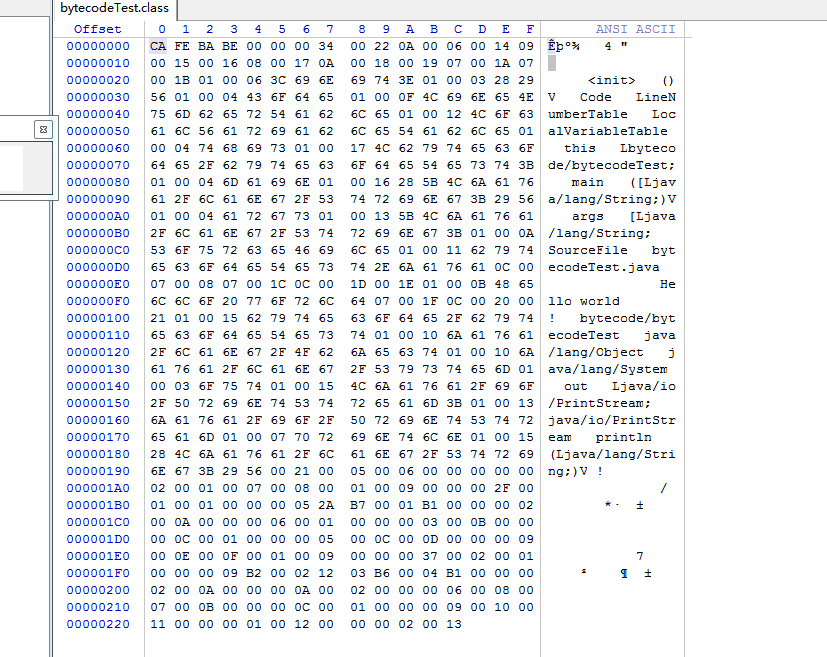

# Java字节码相关分享

## 介绍

1. 字节码

  *  字节码（Byte-code）是一种包含执行程序、由一序列 op 代码/数据对组成的二进制文件。字节码是一种中间码，它比机器码更抽象。它经常被看作是包含一个执行程序的二进制文件，更像一个对象模型。字节码被这样叫是因为通常每个 opcode 是一字节长，但是指令码的长度是变化的。每个指令有从 0 到 255（或十六进制的： 00 到FF)的一字节操作码，被参数例如寄存器或内存地址跟随。

  ```text

  public class bytecodeTest {

    public static void main(String[] args) {
        System.out.println("Hello world");
    }

  }
  ```
  

2. class格式

    ```text
    ClassFile {
        u4 magic;   // 魔数
        u2 minor_version;  // 次版本号
        u2 major_version;  // 主版本号
        u2 constant_pool_count; // 常量池数量
        cp_info constant_pool[constant_pool_count-1]; // 具体常量池信息
        u2 access_flags; // 访问标志
        u2 this_class;  // 类索引
        u2 super_class;  // 当前类索引
        u2 interfaces_count; //接口数量
        u2 interfaces[interfaces_count]; //接口索引
        u2 fields_count; // 字段数量
        field_info fields[fields_count]; // 字段表
        u2 methods_count; // 方法数量
        method_info methods[methods_count]; // 方法表
        u2 attributes_count; // 属性数量
        attribute_info attributes[attributes_count]; // 属性表
    }
    ```

3. 虚拟机

虚拟机常见的实现方式有两种：Stack based 的和 Register based。比如基于 Stack 的虚拟机有Hotspot JVM、.net CLR，这种基于 Stack 实现虚拟机是一种广泛的实现方法。而基于 Register 的虚拟机有 Lua 语言虚拟机 LuaVM 和 Google 开发的安卓虚拟机 DalvikVM。

    * 基于栈

        一个基于栈的虚拟机会通过IP来获取操作数，其操作数都是保存在栈数据结构中，从栈
        中取出数据、计算然后再将结果存入栈中（LIFO，Last in first out）
    * 基于寄存器

        基于寄存器的虚拟机，它们的操作数是存放在CPU的寄存器的。没有入栈和出栈的操作和概念。但是执行的指令就需要包含操作数的地址了，也就是说，指令必须明确的包含操作数的地址，这不像栈可以用栈指针去操作。

## 字节码指令

* 字节码指令类型
    将字节码指令按照功能分类，指令主要可以分为如下几类：
    1. 存储和加载类指令：主要包括load系列指令、store系列指令和ldc、push系列指令，主要用于在局部变量表、操作数栈和常量池三者之间进行数据调度；
    2. 对象操作指令（创建与读写访问）：比如putfield和getfield就属于读写访问的指令，此外还有putstatic/getstatic，还有new系列指令，以及instanceof等指令。
    3. 操作数栈管理指令：如pop和dup，他们只对操作数栈进行操作。
    4. 类型转换指令和运算指令：如add/div/l2i等系列指令，实际上这类指令一般也只对操作数栈进行操作。
    5. 控制跳转指令：这类里包含常用的if系列指令以及goto类指令。
    6. 方法调用和返回指令：主要包括invoke系列指令和return系列指令。这类指令也意味这一个方法空间的开辟和结束，即invoke会唤醒一个新的java方法空间（新的栈和局部变量表），而return则意味着这个空间的结束回收。

* [JVM指令码表](http://xiaofan0408.github.io/jvm.html)

## 查看字节码的方式

1. javap

    查看字节码可以用jdk自带的工具 javap，他自带的使用说明如下

    ```text

    用法: javap <options> <classes>
    其中, 可能的选项包括:
    -help  --help  -?        输出此用法消息
    -version                 版本信息
    -v  -verbose             输出附加信息
    -l                       输出行号和本地变量表
    -public                  仅显示公共类和成员
    -protected               显示受保护的/公共类和成员
    -package                 显示程序包/受保护的/公共类
                            和成员 (默认)
    -p  -private             显示所有类和成员
    -c                       对代码进行反汇编
    -s                       输出内部类型签名
    -sysinfo                 显示正在处理的类的
                            系统信息 (路径, 大小, 日期, MD5 散列)
    -constants               显示最终常量
    -classpath <path>        指定查找用户类文件的位置
    -cp <path>               指定查找用户类文件的位置
    -bootclasspath <path>    覆盖引导类文件的位置
    ```

2. Java Decompiler

    Java Decompiler是一个开源的java反编译工具，一般比较少直接使用jd-core这个库用代码进行反编译，而是使用jd-gui去反编译

    1. github地址: <https://github.com/java-decompiler>
    2. jd-gui地址<https://github.com/java-decompiler/jd-gui>

3. bytecode-viewer

3. idea 插件

## 实例

通过一个最简单的java程序看下他的字节码，其源代码如下

```java
package bytecode;

public class bytecodeTest {

    public static void main(String[] args) {
        System.out.println("Hello world");
    }

}

```

在他的class文件处使用javap输出字节码，命令为 javap -p -s -c -v byecodeTest.class
输出的字节码如下：

```text
Classfile /D:/Code/testCode/target/classes/bytecode/bytecodeTest.class
  Last modified 2019-8-7; size 557 bytes
  MD5 checksum 3fee8392ac69e00f21959f4208a77bb9
  Compiled from "bytecodeTest.java"
public class bytecode.bytecodeTest
  minor version: 0
  major version: 52
  flags: ACC_PUBLIC, ACC_SUPER
Constant pool:
   #1 = Methodref          #6.#20         // java/lang/Object."<init>":()V
   #2 = Fieldref           #21.#22        // java/lang/System.out:Ljava/io/PrintStream;
   #3 = String             #23            // Hello world
   #4 = Methodref          #24.#25        // java/io/PrintStream.println:(Ljava/lang/String;)V
   #5 = Class              #26            // bytecode/bytecodeTest
   #6 = Class              #27            // java/lang/Object
   #7 = Utf8               <init>
   #8 = Utf8               ()V
   #9 = Utf8               Code
  #10 = Utf8               LineNumberTable
  #11 = Utf8               LocalVariableTable
  #12 = Utf8               this
  #13 = Utf8               Lbytecode/bytecodeTest;
  #14 = Utf8               main
  #15 = Utf8               ([Ljava/lang/String;)V
  #16 = Utf8               args
  #17 = Utf8               [Ljava/lang/String;
  #18 = Utf8               SourceFile
  #19 = Utf8               bytecodeTest.java
  #20 = NameAndType        #7:#8          // "<init>":()V
  #21 = Class              #28            // java/lang/System
  #22 = NameAndType        #29:#30        // out:Ljava/io/PrintStream;
  #23 = Utf8               Hello world
  #24 = Class              #31            // java/io/PrintStream
  #25 = NameAndType        #32:#33        // println:(Ljava/lang/String;)V
  #26 = Utf8               bytecode/bytecodeTest
  #27 = Utf8               java/lang/Object
  #28 = Utf8               java/lang/System
  #29 = Utf8               out
  #30 = Utf8               Ljava/io/PrintStream;
  #31 = Utf8               java/io/PrintStream
  #32 = Utf8               println
  #33 = Utf8               (Ljava/lang/String;)V
{
  public bytecode.bytecodeTest();
    descriptor: ()V
    flags: ACC_PUBLIC
    Code:
      stack=1, locals=1, args_size=1
         0: aload_0
         1: invokespecial #1                  // Method java/lang/Object."<init>":()V
         4: return
      LineNumberTable:
        line 6: 0
      LocalVariableTable:
        Start  Length  Slot  Name   Signature
            0       5     0  this   Lbytecode/bytecodeTest;

  public static void main(java.lang.String[]);
    descriptor: ([Ljava/lang/String;)V
    flags: ACC_PUBLIC, ACC_STATIC
    Code:
      stack=2, locals=1, args_size=1
         0: getstatic     #2                  // Field java/lang/System.out:Ljava/io/PrintStream;
         3: ldc           #3                  // String Hello world
         5: invokevirtual #4                  // Method java/io/PrintStream.println:(Ljava/lang/String;)V
         8: return
      LineNumberTable:
        line 9: 0
        line 10: 8
      LocalVariableTable:
        Start  Length  Slot  Name   Signature
            0       9     0  args   [Ljava/lang/String;
}
SourceFile: "bytecodeTest.java"

```

[实例2](./demo2.md)

## java操作字节码

1. javaagent

    * 由于对字节码修改功能的巨大需求，JDK 从 JDK5 版本开始引入了java.lang.instrument 包。基本的思路是在 JVM 启动的时候添加一个代理，每个代理是一个 jar 包，其 MANIFEST.MF 文件里指定了代理类，这个代理类包含一个 premain 方法。JVM 在类加载时候会先执行代理类的 premain 方法，再执行 Java 程序本身的 main 方法，这就是 premain 名字的来源。在 premain 方法中可以对加载前的 class 文件进行修改。JDK6 还允许 JVM 在启动之后动态添加代理。

2. ASM

    * ASM 是一个 Java 字节码操控框架。它能被用来动态生成类或者增强既有类的功能。ASM 可以直接产生二进制 class 文件，也可以在类被加载入 Java 虚拟机之前动态改变类行为。Java class 被存储在严格格式定义的 .class 文件里，这些类文件拥有足够的元数据来解析类中的所有元素：类名称、方法、属性以及 Java 字节码（指令）。ASM 从类文件中读入信息后，能够改变类行为，分析类信息，甚至能够根据用户要求生成新类。
    * [ASM官网](https://asm.ow2.io/)
    * [ASM文档](https://asm.ow2.io/developer-guide.html)

3. byte buddy

4. javassist 

## 简单例子

## 字节码修改技术的应用

1. 代码生成
   1. cglib
   2. fastjson

2. Aop
   1. spring aop

3. 无侵入APM全链路监控
   1. skywalking
   2. arthas   
4. 协程

## 相关资料

1. [oracle官方文档](https://docs.oracle.com/javase/specs/index.html)

2. [Java虚拟机规范(Java SE 8版)](https://book.douban.com/subject/26418340/)

3. [深入理解Java虚拟机：JVM高级特性与最佳实践](https://book.douban.com/subject/24722612/)

4. [JVM 字节码从入门到精通](https://juejin.im/book/5c25811a6fb9a049ec6b23ee)
