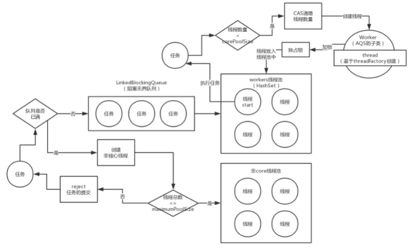
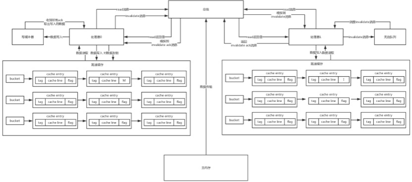
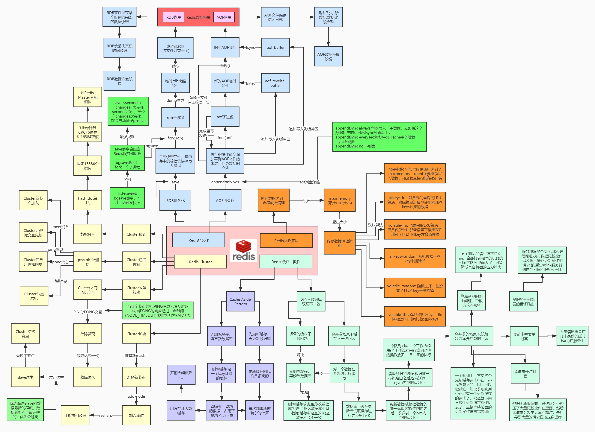
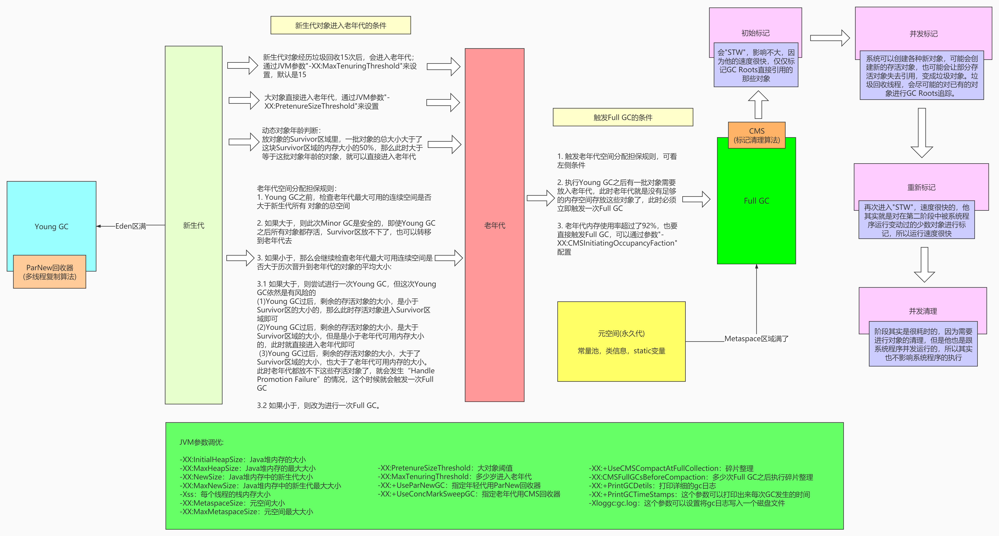

# 记录

## Java基础

* 线程池参数设定，为什么这么设定，作用？7大参数

  线程池原理

* 优先级队列的底层原理

  最大堆、最小堆

* java hashMap和redis map的rehash有什么区别？

   Java hashMap rehash基于高低位链表,当前节点数组下标元素rehash不变或+旧的容量,存在线程安全问题和fail-fast 
   
   redis字典中包含两个哈希表和trehashidx，当标识为-1代表未进行rehash,rehash过程是ht[0]表数据迁移到ht[1],整个hash的过程是渐进式rehash分多次执行完成防止因为某个槽key太多停止服务,在rehash的过程中删除,查找,更新等操作会在两个哈希表执行

* java的线程池你们是怎么用的？原理是什么？怎么设置参数？有哪些状态？用了线程池有哪些问题？你们怎么解决的？Future是干嘛的？

  线程池工作原理，老师架构课画图讲过，下面这张图，边画边跟面试官讲

  
  
  线程池状态:初始状态-->可运行状态-->运行状态-->休眠状态-->终止状态 ; 
  线程池问题:无界队列OOM(使用有界队列和备忘录),过饱问题:增加消费者或自定义拒绝策略降低消费者速率 ; 
  future:对runnable或callable的执行结果处理

* 简述HashMap的底层原理 

  1. hash算法：为什么要⾼位和低位做异或运算？答：让⾼位也参与hash寻址运算，降低hash冲突 
  2. hash寻址：为什么是hash值和数组.length - 1进⾏与运算？答：因为取余算法效率很低，按位与运算效率⾼
  3. hash冲突的机制：链表，超过8个以后，红⿊树（数组的容量⼤于等于64） 
  4. 扩容机制：数组2倍扩容，重新寻址（rehash），hash & n - 1，判断⼆进制结果中是否多出⼀个 bit的1，如果没多，那么就是原来的index，如果多了出来，那么就是index + oldCap，通过这个⽅式。就 避免了rehash的时候，⽤每个hash对新数组.length取模，取模性能不⾼，位运算的性能⽐较⾼ JDK 1.8以后，优化了⼀下，如果⼀个链表的⻓度超过了8，就会⾃动将链表转换为红⿊树，查找的性能， 是O(logn)，这个性能是⽐O(n)要⾼的
  5. 红⿊树是⼆叉查找树，左⼩右⼤，根据这个规则可以快速查找某个值 
  6. 但是普通的⼆叉查找树，是有可能出现瘸⼦的情况，只有⼀条腿，不平衡了，导致查询性能变成 O(n)，线性查询了
  7. 红⿊树，红⾊和⿊⾊两种节点，有⼀⼤堆的条件限制，尽可能保证树是平衡的，不会出现瘸腿的情况 
  8. 如果插⼊节点的时候破坏了红⿊树的规则和平衡，会⾃动重新平衡，变⾊（红 <-> ⿊），旋转，左 旋转，右旋转

* volatile关键字底层原理，volatile关键字是否可以禁⽌指令重排以及如何底层如何实现的指令重排 

   1. 这⾥贴下⽯杉⽼师在讲volatile关键字底层原理画的图：硬件级别的原理: http://note.youdao.com/s/Mr2SnBoK 下⾯是我根据⽼师的思路学习的笔记
   2. 主动从内存模型开始讲起，原⼦性、可⻅性、有序性的理解，volatile关键字的原理 java内存模型：http://note.youdao.com/s/MKm6vAP8
   3. 可⻅性：⼀个线程修改了变量，其他线程能⻢上读取到该变量的最新值    read（从主存读取），load（将主存读取到的值写⼊⼯作内存），use（从⼯作内存读取数据来计 算），assign（将计算好的值重新赋值到⼯作内存中），    store（将⼯作内存数据写⼊主存），write（将store过去的变量值赋值给主存中的变量）     这个是流程图：http://note.youdao.com/s/XazdAWWu
   4. volatile读的内存语义如下：当读⼀个volatile变量时，JMM会把该线程对应的本地内存置为⽆效。 线程接下来将从主内存中读取共享变量。    
   这个是流程图：http://note.youdao.com/s/GBzGnrOH  
      * 当读flag变量后，本地内存B包含的值已经被置为⽆效。此时，线程B必须从主内存中读取共享变 量，线程B的读取操作将导致本地内存B与主内存 中的共享变量的值变成⼀致。  
      * volatile写和volatile读的内存语义总结： 线程A写⼀个volatile变量，实质上是线程A向接下来将要读这个volatile变量的某个线程发出了（其对共享 变量所做修改的）消息。 线程B读⼀个volatile变量，实质上是线程B接收了之前某个线程发出的（在写这个volatile变量之前对共享 变量所做修改的）消息。 线程A写⼀个volatile变量，随后线程B读这个volatile变量，这个过程实质上是线程A通过主内存向线程B发送消息。
    5. 锁的释放和获取的内存语义：当线程释放锁时，JMM会把该线程对应的本地内存中的共享变量刷新到主内存中。当线程获取锁时，JMM会把该线程对应的本地内存置为⽆效。从⽽使得被监视器保护的临界区代码必须从主内存中读取变量。
    6. 有序性：基于happens-before原则来看volatile关键字如何保证有序性    
    这个是流程图：http://note.youdao.com/s/BPU2J7te   
    happens-before规则 
    * 程序顺序规则：⼀个线程中的每个操作，happens-before于该线程中的任意后续操作。 
    * 监视器锁规则：对⼀个锁的解锁，happens-before于随后对这个锁的加锁
    * volatile变量规则：对⼀个volatile变量域的写，happens-before于任意后续对这个volatile域的读
    * 传递性：如果A happens-before B，且B happens-before C，那么A happens-before C。 
    * start()规则：如果线程A执⾏操作ThreadB.start()（启动线程B），那么A线程的 ThreadB.start()操作happens-before于线程B中的任意操作。 
    * join()规则：如果线程A执⾏操作ThreadB.join()并成功返回，那么线程B中的任意操作happensbefore与线程A从ThreadB.join()操作成功返回。

    7. 原⼦性：volatile关键字不能保证原⼦性，唯⼀的场景就是在32位虚拟机，对long/double变量的赋 值写是原⼦的，volatile关键字底层原理，lock指令以及内存屏， 
    8. lock指令：volatile实现的两条原则 
    * Lock前缀指令会引起处理器缓存回写到内存。 
    * ⼀个处理器的缓存回写到内存会导致其他处理器的缓存失效。 
    * 缓存⼀致性协议：http://note.youdao.com/s/NDbe0gMB

* 说下对ThreadLocal认知，项目中的应用场景

    我:xxx场景，常用方法，原理，可能出现的内存泄漏问题，一般如何解决

* 讲讲你知道的一些锁

    我:公平锁和非公平锁,可重入锁(可递归)和非可重入锁,独享锁和共享锁,互斥锁 / 读写锁,乐观锁 / 悲观锁,自旋锁......

    然后根据锁提出的，讲讲synchronized和ReentractLock的原理和区别
    我:从硬件层面讲到java层面，举出了区别和应用场景，说道了哪些框架和源码用了

* 线程的一些方法wait,notify，condition await() signal()

   我:先从方法属于什么类，有什么作用，一般什么场景用，有什么区别，甚至可以说下替代方案(表明自己的一个技术广度)

* 说下HashMap吧，1.7和1.8有什么区别，了解红黑树吗?1.8为什么这么用红黑树
  
   我:xxx ,最关键是死循环，底层数据结构的变化，说了一些红黑树特性，具体没特别深入研究

*  讲讲为什么ConcurrentHashMap是并发安全的吧，既然有锁怎么去统计size呢

   我:xxx，从1.7讲到1.8,从分段锁讲到cas+sync....size的统计1.7和1.8也有区别

*  sync的底层实现，锁优化，和lock的对比等

    todo

* Java 的锁怎么实现的？有哪些？HashMap key可以为null,为什么ConcurrentHashMap key 不可以为null ?非公平锁怎么实现的？AQS每个Node里的节点状态是干嘛用的？

  锁的实现基于aqs,常用ReentrantLock ReentrantReadWriteLock ; ConcurrentHashMap不能为null原因,无法去判断到底是key不存在还是value为null; 非公平锁基于cas实现 ;节点状态 CANCELLED:已取消调度 SIGNAL:唤醒后继节点 CONDITION:等待其他线程调用condition.signal()从等待队列到同步队列中获取锁 PROPAGATE:共享模式 前继节点不仅会唤醒后续节点

* Synchronized  volatile 的作用？原理？怎么用？什么时候用

    synchronized原理图

    

    volatile原理图

    
    
   volatile常用场景优雅停机 注册中心服务实例心跳可见等,建议大家看下老师面试突击第三季并发部分内容，对上面这些关键字均有硬件级别的讲解

  
* 问题：线程有⼏种状态，状态之间的变化是怎样的？ Java线程在运⾏的声明周期中可能处于6种不同的状态，在给定的⼀个时刻，线程只能处于其中的⼀个状
态

 这⾥我弄了⼏张图：
 
  1. http://note.youdao.com/s/ODYruIR9 

  2. http://note.youdao.com/s/cm4ARggj

* 问题：简述线程池的原理，⾃定义线程池的参数以及每个参数的意思，线程池有哪⼏种，分别的应⽤场景
举例
 
 ⼤家先看下这个构造图：http://note.youdao.com/s/AO4EncTZ corePoolSize：线程池⾥应该有多少个线程
maximumPoolSize：如果线程池⾥的线程不够⽤了，等待队列还塞满了，此时有可能根据不同的线程池的 类型，可能会增加⼀些线程出来，但是最多把线程数量增加到maximumPoolSize指定的数量 keepAliveTime + TimeUnit：如果你的线程数量超出了corePoolSize的话，超出corePoolSize指定数量 的线程，就会在空闲keepAliveTime毫秒之后，就会⾃动被释放掉 workQueue：你的线程池的等待队列是什么队列
threadFactory：在线程池⾥创建线程的时候，你可以⾃⼰指定⼀个线程⼯⼚，按照⾃⼰的⽅式创建线程出
来
 RejectedExecutionHandler：如果线程池⾥的线程都在执⾏任务，然后等待队列满了，此时增加额外线 程也达到了maximumPoolSize指定的数量了，这个时候实在⽆法承载更多的任务了，此时就会执⾏这个东 ⻄（拒绝策略）   上⾯的基本参数的意义以外。我还推荐⼤家看下 美团技术团队写的《Java线程池实现原理及其在美团业 务中的实践》   https://tech.meituan.com/2020/04/02/java-pooling-pratice-in-meituan.html 这篇⽂章，写的
⾮常⼲。

* 问题：说一下 HashMap 的工作原理(简单描述下回答思路) 
1. 底层数据结构 
2. 初始化核心参数 
3. hash 算法
4. 寻址算法 
5. hash 冲突 
6. 扩容机制 
7. put 方法,get 方法和 remove 方法执行流程
8. hashMap 是否是线程安全

* 问题：说一下线程安全 ConcurrentHashMap 的工作原理(简单描述下回答思路)
 1. 底层数据结构 
 2. hash 算法 
 3. 寻址算法 
 4. put 方法流程,get 方法,remove 方法,size 方法
 5. jdk1.7 和 1.8 底层实现区别,可能会被问到 1.7 如何去锁 segment

* 问题：volatile 硬件底层原理,cas 和 synchronized 原理? 

1. 学习资料:石杉老师面试突击第三季 volatile 硬件级别讲解(强烈建议看一下) 自己整理的笔记:http://note.youdao.com/s/H02nMj8u 
2. 重点说一下回答思路: 
   
   1. 为了解决处理器与主存之间的速度鸿沟,引入高速缓存,却又导致了缓存一致性问题
   2. 为了解决缓存一致性问问题,引入了如 MESI 等技术,又导致了处理器等待问题 
   3. 为了解决处理器等待问题,引入了写缓冲区和无效队列,又导致了重排序和可见性问 题 
   4. 为了解决重排序和可见性问题,引入了内存屏障 
   5. 每个技术点跟面试官举工作中的场景或者源码中场景知道为什么要学它,学了它后有 什么用,比如 volatile(aqs 中 stateconcurrentHashMap 中 Node 节点),线程池的 ctl(atomic 高三 位:线程池状态 低位:线程池 worker 线程数量),concurrentHashMap(cas+synchronized),工作中 优化停机,心跳时间等

* 问题: 线程池的工作原理和线程池的应用场景 

1. 学习资料:石杉老师面试突击第三季线程池工作原理 
2. 自己整理的笔记:http://note.youdao.com/s/G4t8hOyT 

* 问题: 说一下 ThreadLocal 工作原理和使用场景 

1. 学习资料:石杉老师面试突击第三季 threadLocal 工作原理 
2. 使用场景:石杉老师架构班中比如 zuul 源码中 RequestContext 和分布式文件系统写 editLog 的 txId 
3. 自我整理的笔记:http://note.youdao.com/s/341vlwEp

* 谈谈你对synchronized和volatile的理解？对AQS的理解？

  问题分析：⾸先这块可以直接从硬件层⾯原理讲起 
  
  原理图：https://www.yuque.com/dulante-ikt7c/nwecmo/pm6udd

  1：为了解决CPU与主内存速度鸿沟，引⼊⾼速缓存，引发缓存⼀致性问题 
  
  2：为了解决缓存⼀致性问题，引⼊MESI等技术，引发CPU等待问题 
  
  3：为了解决CPU等待问题，引⼊写缓冲器与⽆效队列，引发重排序与可⻅性问题 
  
  4：为了解决重排序与可⻅性问题，引⼊内存屏障
  volatile保证有序性和可⻅性，以及在双重检测中保证的有序性 然后给⾯试官讲解下MESI的流程，再紧跟着画图阐述synchronized的底层原理

  https://www.yuque.com/dulante-ikt7c/nwecmo/cn5wqk
  等你说完之后，可能接着会追问AQS的问题？ 然后你紧跟着画图阐述下AQS的实现原理，核⼼是state、currentThread、waitQueue三部分。 https://www.yuque.com/dulante-ikt7c/nwecmo/cb3ens

  等你说完之后 ，为了表现⾃⼰ ， 你 还 可 以 说 ⾃ ⼰ 看 过 redission 和 curator 的 源 码 https://www.yuque.com/dulante-ikt7c/nwecmo/ohft6n
  核⼼提到watchdog开⻔狗机制，以及加锁的数据结构，⼀个hash+2个队列，以及队列中的分数重排。核 ⼼提到zk基于⽂件⽬录树的结构，添加监听器来进⾏排队加锁。
  这样当你从synchronized，volatile⼀直聊到AQS，再到redission和curator，然后在做⼀个总结，关于 锁就⽐较全⾯了，也体现了你的思考。 zookeeper分布式锁：https://www.yuque.com/dulante-ikt7c/dy8hn4/gqu12e

### 资料
  * 集合
  
   来源于老师的架构班，跟老师一起看的源码，总结的
  链接：http://note.youdao.com/noteshare?id=efd2a3a29d2626acea2b053e56bae5cc

  * 线程池

  来源于老师的架构课，以下是我自己的总结：
http://note.youdao.com/noteshare?id=e58584311f5cb3b89154fcac6c1d8004&sub=8037451384FE4687AC50C9A16C7C33EB

* 并发

  来源于老师的架构课，下面是自己的总结：
https://blog.csdn.net/qq_17164811/article/details/107432496

## Redis

* redis分布式的认知，让你自己线程一个redis分布式锁你怎么实现

   我:应用场景，不用分布式锁会有什么问题，分布式锁如何解决这个问题，还存在什么问题，如何去解决，原理清楚吗？是否还有其他的替代方案，让你自己设计你怎么写

*  redis了解多少?需要设计一个大数据新闻推荐功能你怎么设计?设计一个附近的人功能你怎么设计
  
   我:从数据结构，架构说，新闻推荐可以往布隆过滤说，附近的人可以往基于geohash和有序集合

*  讲讲zset的数据机构，一般应用在什么场景，你项目中有用过吗?解释下跳表
    
    我:底层是跳表实现的，比如会应用在点赞排行榜之类的场景，xxxx
redis数据结构，使用场景，微博场景使用redis如何去设计用户关系

* redis你了解哪些？你工作什么场景用？底层数据结构有哪些？分布式锁怎么用？有哪些问题？你们怎么解决的？数据一致性你们怎么做的？分布式事务了解不？你们用过没？你们怎么用的？用了之后有啥问题？你们怎么解决的？redis如何可以动态扩容和缩容？如果你来设计，你怎么设计？

   redis 数据结构类型 内存淘汰策略 过期策略 持久化rdb和aof  主从集群(哨兵高可用) 复制和redisCluster这些建议大家看一下《redis设计与实现》 ; 分布式锁:原生set nx ex+lua(get+del)或redisson hash结构支持可重入 或redLock或优化版本加上栅栏验证token ;数据库和缓存一致性推荐大家看一下老师早期出的亿级流量;分布式事务这里就直接引用老师gitee上的文章了
https://gitee.com/shishan100/Java-Interview-Advanced/blob/master/docs/distributed-system/distributed-transaction.md

Redis知识点对应的⽼师的课程：亿级流量电商详情⻚系统实战 ⾯试官提问的部分问题： * 问题：分别介绍下redis的内存模型和线程模型 

https://gitee.com/shishan100/Java-Interview-Advanced/blob/master/docs/highconcurrency/redis-single-thread-model.md ⽼师的⾯试训练营

* 问题：缓存雪崩以及穿透的解决⽅案？

缓存雪崩发⽣的现象
缓存雪崩的事前事中事后的解决⽅案
事前：redis⾼可⽤，主从+哨兵，redis cluster，避免全盘崩溃 事中：本地ehcache缓存 + hystrix限流&降级，避免MySQL被打死 事后：redis持久化，快速恢复缓存数据
缓存雪崩现象图：http://note.youdao.com/s/XMyKXr25 如何解决缓存⾎崩 ：http://note.youdao.com/s/53UbmTKV
缓存穿透现象以及解决⽅案： http://note.youdao.com/s/1oONTfsh

* 简述redis分布式锁的原理

 https://gitee.com/shishan100/Java-Interview-Advanced/blob/master/docs/distributedsystem/distributed-lock-redis-vs-zookeeper.md  ⽼师的⾯试训练营 ⾃⼰阅读的书籍举例：《Redis设计与实现》

* 问题:redis 数据结构类型有哪些,平时在哪些场景下用过 

1. redis 数据结构类型有哪些:http://note.youdao.com/s/Omt2UtMp 
2. 应用场景:http://note.youdao.com/s/8NPHq37A
* 问题:redis 过期淘汰策略,内存淘汰策略,持久化方式 
1. 内存淘汰策略:http://note.youdao.com/s/O0iHxERv 
2. rdb 持久化:https://www.processon.com/view/link/5f39d0cce0b34d07117334ab 
3. aof 持久化:https://www.processon.com/view/link/5f39fa95e401fd0be031aee5 
* 问题:redis 主从集群+哨兵,redisCluster 工作原理,一致性 hash 的好处
* 问题:redis 的 master 和 slave 的集群可能出现主从之间网络实例抖动,导致重连失败一直需要 进行全量复制你觉得是什么原因? 
1. 复制原理:https://www.processon.com/view/link/5f3b3d18079129531b60ee86
2. 导致的原因:从节点拿 offset 来主节点复制积压缓冲区找时找不到导致全量复制
* 问题:缓存雪崩,缓存穿透,缓存击穿如何解决,平时生产 redis 需要注意什么
 1. 学习资料面试突击第一季: https://gitee.com/shishan100/Java-Interview-Advanced#分布式缓存 
 2. 生产问题 
    1. fork 耗时导致高并发请求下延时(最好控制在 10g 中 fork 子进程需要拷贝父进程的空间内页表 
    2. 避免复制风暴 别一个 master 挂多个 slave 导致都全量复制的时候,占用带宽 可以 slave 上在去挂 slave,即星状变成树 
    3. 匹配 key keys 指令导致的高 cpu 问题(禁止) 如果必须通过 scan 扩容不会重复(高位累加)&缩容的时候会重复 
    4. 危险命令 flushall:清空所有数据。 flushdb:清空本库数据。 请确认在没有请求的情况下再执行以上操作。 (深夜更新时)另外， redis 提供了异步清空命令 flushallasync 和 flushdbasync 异步清空数据，不会阻塞当前线程

* 能简单聊聊你对redis的理解吗？

问题分析： 

⾸先先说明⼀下redis是⼲什么的；⽤redis做缓存，实现⾼性能，⾼并发。在项⽬中⽤string存token，⽤ list存规则等列表数据，⽤hash存⼀些对象数据，⽤zset存城市排名等数据。 ⼀步⼀步这样分析的话，让⾯试官知道你已经⾮常掌握到这块的知识了。

再接着说明下为什么⽤redis，快在哪⾥？ 思维导图：https://www.yuque.com/dulante-ikt7c/nwecmo/cc3l7k
然后可以细化说明其中的知识点，⽐如动态字符串SDS，O(1)时间复杂度获取字符串⻓度；空间预分配机制，⼩于1M加倍，⼤于1M，每次分配1M；惰性空间释放，使⽤free字段记录，后续可以直接使⽤；⼆进 制安全，C中\0表示结束，sds是len表示；DICT中的渐进式rehash过程。

当你聊完这个之后，他可能会追问你关于redis的⽇志了解吗？ 然后你就从rdb和aof讲：https://www.yuque.com/dulante-ikt7c/nwecmo/vz3ztl

紧接着可能会问道redis的主从复制，你就要从全量复制和增量复制两部分来阐述 原理图：https://www.yuque.com/dulante-ikt7c/nwecmo/cydvfk

最后还可能会问你⼀些⽣产问题，⽐如缓存穿透，缓存击穿，热key，⼤key问题如何解决？ 然后你就可以根据⾯试突击中提到的⽅案，⽐如设置随机值，布隆过期器等⽅案，热key和⼤key采⽤拆分的思想即可。

### 资料

* Redis

  1、Redis底层原理从架构班学的，这个我没总结过，就直接看的老师的笔记
  2、redis和 mysql 双写一致性问题，这个看的老师的面试突击的笔记
https://gitee.com/shishan100/Java-Interview-Advanced/blob/master/docs/high-concurrency/redis-consistence.md

  分布式锁
来源于老师的架构课，简单分享两个图
http://note.youdao.com/s/S0EK0NSx

  三级缓存架构；
  我⾃⼰总结了⼀些东⻄，包括笔记和图，附上链接：
  https://www.processon.com/view/link/60aa22936376891bafa845dd

 
## 数据库

* 讲讲mysql索引，原理是什么，如何优化索引

  我: xxxx,B+树，为什么要用B+树,有什么优点

*  给你个sql,你说一下怎么创建索引？索引结构？联合索引为什么用要存储主键id，存主键id的内存地址不行吗？索引计划有哪些指标，你关注哪些指标？你了解mysql哪些锁？都是干嘛的？什么操作会有锁？需要注意什么？

   根据具体的sql来创建索引,联合索引最左原则(字段不超过5个),索引个数5个以内 ; 索引结构:b+树叶子节点存储数据页 ; 如果存储地址值需要二次寻址 ;执行计划指标:select_type type 可能使用的索引 优化器实际使用索引等,主要关注连接类型type,索引使用情况和extra中内容 ; mysql锁:全局锁 表锁(显示锁和元数据锁MDL) 临界锁(间隙锁+行锁),锁注意事项主要还是死锁学会通过show engine innodb status来分析死锁案例  这里推荐大家看下儒猿技术窝的mysql专栏，里面有很详细的讲解

* 问题:mysqlbufferpool 的结构组成,建议从查询和更新操作来讲 笔记:https://www.processon.com/view/link/5f27c4e17d9c0835d3a35995 

* 问题:mysql 通过什么机制来保证事物数据不丢失,MVCC 机制和 read-view 视图 
* 问题:mysql 的索引结构,为什么不使用 B 树使用 B+树,三层索引大概能支持多少数据,sql 如何 优化,覆盖索引,回表查询,索引下推等概念 
* 问题:mysql 的锁有哪些,如何分析死锁问题,死锁如何解决 
* 问题:现在有一个场景需要保证数据库和 redis 的双写一致性,你会如何去做 
* 问题:mysql的水平分库分表,什么情况下水平分表,什么情况下分库,分库分表的中间件你如何 进行技术的选型,分片键有多个如何去做,单表迁移到分库分表方案,分库分表如何扩容

* Mysql的索引有了解吗？为什么⽤B+树？explain呢？

  问题分析： ⾸先你要回答出mysql中索引采⽤的是B+树结构，然后把B+树的结构描述下，延伸到索引下推，索引覆 盖，聚簇索引、辅助索引等等。

  1、Hash哈希，只适合等值查询，不适合范围查询。

  2、⼀般⼆叉树，可能会特殊化为⼀个链表，相当于全表扫描。

  3、红⿊树，是⼀种特化的平衡⼆叉树，MySQL 数据量很⼤的时候，索引的体积也会很⼤，内存放不下的 ⽽从磁盘读取，树的层次太⾼的话，读取磁盘的次数就多了。

  4、B-Tree，叶⼦节点和⾮叶⼦节点都保存数据，相同的数据量，B+树更矮壮，也是就说，相同的数据 量，B+树数据结构，查询磁盘的次数会更少。

  然后关于explain你要回答出⼀下⼏个核⼼字段，序号、type、possible_keys、Key、rows、extra，及每 个字段有哪些常⻅的项。

  然后可能接着会问你关于MVCC的知识？ 你需要从readview视图+undolog链条来回答 

  原理图：https://www.yuque.com/dulante-ikt7c/nwecmo/gl2gmp
### 资料

* Mysql

  我是看的救火队长的MySQL专栏，我这里总结了一篇，抛砖引玉，后续的大家可以自己总结一下，自己整理一遍之后，你会发现这些知识脉络都会很清晰的：
http://note.youdao.com/noteshare?id=41b1f3021980dd84aa37bb110268954d&sub=18CF524AB8C64EB388EF47BE22EA3D64

  MySQL专栏整理的笔记： https://mp.weixin.qq.com/s/aq_vFnsoNCQYlKx2KFzkxQ  
## JVM

* 讲讲你对垃圾回收机制的理解(问题问的很宽泛，就看你怎么回答和理解)

  我:什么是垃圾，为什么要回收，不回收有什么问题，jvm有哪些区域，分别采用哪些回收方案，每个方案有哪些优缺点，为什么适合这个区域

* 面试官: 为什么年轻代e,s1,s2是8:1:1
  
  我:xxxx,内存利用率能方面讲

* 面试官: 工作中有解决过gc问题吗？什么场景下出现的，你如何去排查和解决

  jvm参数调优详细过程，到为什么这么设置，好处，一些gc场景，如何去分析gc日志

* jvm结构？你们jvm的参数是怎么设置的？gc情况怎么样？怎么调优？我们项目的机器差不多每3天一次fullgc,GC已经不能再调优了，这个问题你有啥好的想法吗？

  jvm结构:堆 虚拟机栈 本地虚拟机栈 程序计数器 元空间 ;参数设置新生代3G 1:1:8 老年代:1G ,gc情况大概几分钟到几十分钟一次minor gc 每次大概3-5ms左右,几小时一次full gc 每次不超过1s
  jvm调优:策略:
  1. 对象预留在新生代 
  2. 大对象直接进入老年代 
  3. 设置合理的对象年龄阀值; 3天full gc一次不能优化,当时没回答好说了一下升级为zgc,zgc推荐看一下美团技术团队分享文章 https://mp.weixin.qq.com/s/ag5u2EPObx7bZr7hkcrOTg
  ps：CMS和G1问的比较多，大家面试准备的时候多看看

* 问题：CMS垃圾回收的过程 

  这个是JVM内存划分的图：http://note.youdao.com/s/9MR4PLq7 这⾥援引下儒猿群群友根据《从 0 开始带你成为JVM实战⾼⼿》专栏 总结出来的图，分享给⼤家， https://www.processon.com/view/link/5e69db12e4b055496ae4a673
 
  CMS的⼯作机制相对复杂，垃圾回收过程包含如下4个步骤 
  1. 初始标记：只标记和GC Roots直接关联的对象，速度很快，需要暂停所有⼯作线程。 
  2. 并发标记：和⽤户线程⼀起⼯作，执⾏GC Roots跟踪标记过程，不需要暂停⼯作线程。 
  3. 重新标记：在并发标记过程中⽤户线程继续运⾏，导致在垃圾回收过程中部分对象的状态发⽣变化， 为了确保这部分对象的状态正确性，需要对其重新标记并暂停⼯作线程。 
  4. 并发清除：和⽤户线程⼀起⼯作，执⾏清除GC Roots不可达对象的任务，不需要暂停⼯作线程。

* 问题：G1与CMS的区别，你们公司使⽤的是哪个，为什么？（这个需要结合⾃⼰的业务场景回答） 

   相对于CMS垃圾收集器，G1垃圾收集器两个突出的改进。 
   1. 基于标记整理算法，不产⽣内存碎⽚。 
   2. 可以精确地控制停顿时间，在不牺牲吞吐量的前提下实现短停顿垃圾回收。

* 问题：JVM参数举例，讲讲为什么这么设置，为了避免fullGC的停顿对系统的影响，有哪些解决⽅案？
 
  由于⽂本不⽅便贴代码，贴在在了有道云笔记⾥⾯：http://note.youdao.com/s/X4Qmucr0 为解决应⽤在午⾼峰发⽣ full gc ⽽影响系统响应时间问题, 考虑低峰期主动进⾏ full gc 对 old 区进⾏释 放. 确保启动参数中 -XX:+DisableExplicitGC 项被删除, 该参数作⽤是禁⽌ System.gc() 调⽤. (启动参数⼀ 般配在 start 脚本中) 在启动参数中加⼊ -XX:+ExplicitGCInvokesConcurrentAndUnloadsClasses, 该参数的作⽤是主动 System.gc() 时调⽤ CMS 算法进⾏ gc 操作.

* 问题：内存模型以及分区，需要详细到每个区放什么

  JVM 分为堆区和栈区，还有⽅法区，初始化的对象放在堆⾥⾯，引⽤放在栈⾥⾯， class 类信息常量池 (static 常量和 static 变量)等放在⽅法区 
  1. ⽅法区:主要是存储类信息，常量池(static 常量和 static 变量)，编译后的代码(字 节码)等数据 
  2. 堆:初始化的对象，成员变量 (那种⾮ static 的变量)，所有的对象实例和数组都要 在堆上分配
  3. 栈:栈的结构是栈帧组成的，调⽤⼀个⽅法就压⼊⼀帧，帧上⾯存储局部变量表，操 作数栈，⽅法出 ⼝等信息，局部变量表存放的是 8 ⼤基础类型加上⼀个应⽤类型，所 以还是⼀个指向地址的指针 
  4. 本地⽅法栈:主要为 Native ⽅法服务 
  5. 程序计数器:记录当前线程执⾏的⾏号

*  问题：JVM内存分那⼏个区，每个区的作⽤是什么？

  java 虚拟机主要分为以下⼀个区: 
  
- ⽅法区: 

   1. 有时候也成为永久代，在该区内很少发⽣垃圾回收，但是并不代表不发⽣ GC，在这⾥ 进⾏的 GC 主要是对⽅法区⾥的常量池和对类型的卸载
   2. ⽅法区主要⽤来存储已被虚拟机加载的类的信息、常量、静态变量和即时编译器编译后 的代码等数据。 
   3. 该区域是被线程共享的。 
   4. ⽅法区⾥有⼀个运⾏时常量池，⽤于存放静态编译产⽣的字⾯量和符号引⽤。该常量池 具有动态性， 也就是说常量并不⼀定是编译时确定，运⾏时⽣成的常量也会存在这个常量池中。

- 虚拟机栈: 
   1. 虚拟机栈也就是我们平常所称的栈内存,它为 java ⽅法服务，每个⽅法在执⾏的时候都 会创建⼀个栈帧，⽤于存储局部变量表、操作数栈、动态链接和⽅法出⼝等信息。 
   2. 虚拟机栈是线程私有的，它的⽣命周期与线程相同。 
   3. 局部变量表⾥存储的是基本数据类型、returnAddress 类型(指向⼀条字节码指令的地 址)和对象引⽤， 这个对象引⽤有可能是指向对象起始地址的⼀个指针，也有可能是代表 对象的句柄或者与对象相关联的位置。局部变量所需的内存空间在编译器间确定
   4. 操作数栈的作⽤主要⽤来存储运算结果以及运算的操作数，它不同于局部变量表通过索 引来访问，⽽是 压栈和出栈的⽅式 
   5. 每个栈帧都包含⼀个指向运⾏时常量池中该栈帧所属⽅法的引⽤，持有这个引⽤是为 了 ⽀持⽅法调⽤过程中的动态连接.动态链接就是将常量池中的符号引⽤在运⾏期转化为直接 引⽤。
- 本地⽅法栈和虚拟机栈类似，只不过本地⽅法栈为 Native ⽅法服务。 

- 堆： 

  java 堆是所有线程所共享的⼀块内存，在虚拟机启动时创建，⼏乎所有的对象实例都在这 ⾥创建，因此该区域经常发⽣垃圾回收操作。

- 程序计数器:

  内存空间⼩，字节码解释器⼯作时通过改变这个计数值可以选取下⼀条需要执⾏的字节码 指 令，分⽀、循环、跳转、异常处理和线程恢复等功能都需要依赖这个计数器完成。该内 存区域是唯⼀⼀个 java 虚拟机规范没有规定任何 OOM 情况的区域。

* 问题：堆⾥⾯的分区：Eden，survival (from+ to)，⽼年代，各⾃的特点。

   堆⾥⾯分为新⽣代和⽼⽣代(java8 取消了永久代，采⽤了 Metaspace)，新⽣代包 含 Eden+Survivor 区， survivor 区⾥⾯分为 from 和 to 区，内存回收时，如果⽤的是复 制算法， 从 from 复制到 to，当经过⼀次或者多次 GC 之后，存活下来的对象会被移动 到⽼年区，当 JVM 内存不 够⽤的时候， 会触发 Full GC，清理 JVM ⽼年区 当新⽣区满了之后会触发 YGC,先把存活的对象放到其中⼀个 Survice 区，然后进⾏垃圾清理。 因为如果仅仅清理需要删除的对象，这样会导致内存碎 ⽚，因此⼀般会把 Eden 进⾏完全的清理，然后整 理内存。那么下次 GC 的时候， 就会使⽤下⼀个 Survive，这样循环使⽤。如果有特别⼤的对象，新⽣代放不下， 就会使⽤⽼年代的担 保，直接放到⽼年代⾥⾯。因为 JVM 认为，⼀般⼤对象的存 活时间⼀般⽐较久远。

* 问题：如何判断⼀个对象是否存活？（或者GC对象的判定⽅法） 

  判断⼀个对象是否存活有两种⽅法: 
  1. 引⽤计数法 所谓引⽤计数法就是给每⼀个对象设置⼀个引⽤计数器，每当有⼀个地⽅引⽤这个对象 时， 就将计数器加⼀，引⽤失效时，计数器就减⼀。当⼀个对象的引⽤计数器为零时，说 明此对象没有被引 ⽤， 也就是“死对象”,将会被垃圾回收. 引⽤计数法有⼀个缺陷就是⽆法解决循环引⽤问题， 也就是说当对象 A 引⽤对象 B，对象 B ⼜引⽤者对象 A，那么此时 A,B 对象的引⽤计数器都不为零，也就造成⽆法完成垃圾回 收，所以主流的虚拟机都没有采⽤这种算法。
  2. 可达性算法(引⽤链法) 该算法的思想是:从⼀个被称为 GC Roots 的对象开始向下搜索，如果⼀个对象到 GC Roots 没有任何引 ⽤链相连时，则说明此对象不可⽤。 在 java 中可以作为 GC Roots 的对象有以下⼏种: • 虚拟机栈中引⽤的对象 ⽅法区类静态属性引⽤的对象 • ⽅法区常量池引⽤的对象，本地⽅法栈 JNI 引⽤的对象 虽然这些算法可以判定⼀个对象是否能被回收，但是当满⾜上述条件时，⼀个 对象⽐不⼀ 定会被回收。当⼀个对象不可达 GC Root 时，这个对象并 不会⽴⻢被回收，⽽是出于⼀个死 缓的阶段，若要被真正的回收需要经历两次标记 如果对象在可达性分析中没有与 GC Root 的引⽤链，那 么此时就会被第⼀次标记并且进⾏ ⼀次筛选，筛选的条件是是否有必要执⾏ finalize()⽅法。当对象没有 覆盖 finalize()⽅法 或者已被虚拟机调⽤过，那么就认为是没必要的。
  如果该对象有必要执⾏ finalize()⽅法，那么这个对象将会放在⼀个称为 F-Queue 的对队 列中，虚拟机 会触发⼀个 Finalize()线程去执⾏，此线程是低优先级的，并且虚拟机不会承 诺⼀直等待它运⾏完，这是 因为如果 finalize()执⾏缓慢或者发⽣了死锁，那么就会造成 F- Queue 队列⼀直等待，造成了内存回收 系统的崩溃。GC 对处于 F-Queue 中的对象进⾏ 第⼆次被标记，这时，该对象将被移除”即将回收”集 合，等待回收。

* 问题：服务类加载过多引发的OOM问题如何排查

如果服务出现⽆法调⽤接⼝假死的情况，⾸先要考虑的是两种问题 
1. 第⼀种问题，这个服务可能使⽤了⼤量的内存，内存始终⽆法释放，因此导致了频繁GC问题。 也许每秒都执⾏⼀次Full GC，结果每次都回收不了多少，最终导致系统因为频繁GC，频繁Stop the World，接⼝调⽤出现频繁假死的问题 
2. 第⼆种问题，可能是这台机器的CPU负载太⾼了，也许是某个进程耗尽了CPU资源，导致你这个服 务的线程始终⽆法得到CPU资源去执⾏， 也就⽆法响应接⼝调⽤的请求。这也是⼀种情况。

在内存使⽤这么⾼的情况下会发⽣什么？ 

1. 第⼀种，是内存使⽤率居⾼不下，导致频繁的进⾏Full GC，gc带来的stop the world问题影响了服务。 

2. 第⼆种，是内存使⽤率过多，导致JVM⾃⼰发⽣OOM。

3. 第三种，是内存使⽤率过⾼，也许有的时候会导致这个进程因为申请内存不⾜，直接被操作系统把这个进
程给杀掉了

1. 问题：如何在JVM内存溢出的时候⾃动dump内存快照？ 

-XX:+HeapDumpOnOutOfMemoryError -XX:HeapDumpPath=/usr/local/app/oom 第⼀个参数意思是在OOM的时候，⾃动dump内存快照出来，第⼆个参数是说把内存快照放到哪去 ⾃⼰阅读的书籍举例：《实战Java虚拟机：JVM故障诊断与性能优化（第2版）》

* 问题:jvm 的内存分配和执行原理以及类加载过程 
* 问题:常用垃圾收集器有哪些,你们线上用的什么收集器,CMS 优化,G1 工作原理 
* 问题:线上机器 cpu 负载过高如何去排查,如何去优化 JVM 参数
* 问题:是否有遇到过线上 OOM 情况,如何去排查的(这个拿老师案例说一下)
1. 触发OOM的地方metaspace,线程虚拟机栈,堆内存,堆外内存专栏对应的场景都有案例我面 试说了一个堆外内存溢出的情况 
2. 业务背景:公司IM系统使用netty来进行消息推送,有人在pipeline中自己创建byteBuf未释放 
3. 分析问题: 
    1. 先通过 OOM 后自动生成的堆快照信息通过 mat 分析可能出现的地方和线程的调用 栈定位到代码行 
    2. 当并发量较大时堆内存持有堆外内存引用的对象进入老年代一直不能被回收,当通 过jdkByteBuffer.allocateDirect(xx)时java.nio.Bits#reserveMemory尝试的去分配堆外内存,如果 堆外内存空间不够时会执行一次 System.gc()通知 jvm 来进行一次 fullgc 
    3. 但是由于线上 jvm 参数-XX:DisableExplicitGC 禁止 system.gc()导致堆外内存溢出

* 谈谈你对jvm的理解？ 

⽤的架构班⽼铁之前分享的博客： https://blog.csdn.net/qq_17164811/article/details/107141112

### 资料

  
* 这个把救火队长的jvm吃透了，特别是调优的部分。这个很重要，能拿下的几个offer，这个专栏功不可没。把整个专栏学完后，自己默写一遍才能融汇贯通
下面这个是我默写的
https://blog.csdn.net/qq_17164811/article/details/107141112

## Spring

* 说说springBean的一个加载流程吧，如何解决循环依赖问题

   我:xxx,讲下什么是循环依赖，哪些情况会造成循环依赖，如何解决循环依赖(重点说明单例，缓存)

* spring事务了解吗，讲讲原理，@Transactional作用在方法A,B的事务生效情况
 
  我:xxx,从代理层面，从事务的传播特性讲

*  讲讲spring的AOP吧，业务中有用到吗？如何实现的，不同代理实现的区别
  
  我:xxx面向切面编程,jdk动态代理和cglib代理方向讲，区别最主要是属于不一样，修饰地方不一样。

* spring的循环依赖如何解决？为什么要三级缓存？

## 分布式

* 说说CAP理论吧，为什么只可能是CP或者AP呢？C和A为什么不能共存

  我:先解散概念，举例说明一致性和可靠性为什么不能共存，最好可以举例哪些框架是CP或者AP的

* 了解gissip协议吗？跟raft和paxos有什么区别，zk有了解吗？用的什么协议
 
  我:xxxx 主要从CP和AP入手，以及协议的应用框架,优缺点，为什么这么用

* 讲讲分布式事物吧，你熟悉的分布式事物框架，项目中有应用吗？框架的原理是什么？如果让你自己去设计你怎么设计
   
   我:ttc,最终消息一致性，最大努力通知，分别用在什么场景，底层怎么实现的去回答

* 问题:分布式锁使用过哪些,使用场景 

方案:http://note.youdao.com/s/9I3mdlyC 

Zkcurator 源码:http://note.youdao.com/s/S7rvozW2 

Redisson:http://note.youdao.com/s/GgheHWp6

* 问题:分布式事务有使用过吗?在哪些场景下?说一下 byteTcc 的方案?seata 有了解过?saga 的原理有了解过吗? 
1. 学习资料:面试突击第二季或者石杉老师架构班的分布式事务原理和实战 
2. 笔记:http://note.youdao.com/s/I2SJpVam 
3. byteTcc 源码:http://note.youdao.com/s/ToAMxuGZ 
4. seata 官网:http://seata.io/zh-cn/docs/dev/mode/tcc-mode.html

### 资料

*  ByteTCC

  来源于老师的架构课，这个也是个杀手锏，这个我自己总结的不多，大体上看的都是老师的笔记，我就简单分享一下
http://note.youdao.com/noteshare?id=2bd16f1dc4641721f11c22d8b02085d7&sub=EA30000449C04FA9B6525FEFE5D7AF9E

## 消息队列

* 我看你们项目中有用消息中间件，你们用的哪些，怎么去选型呢
 
   我:主要是rocketmq和kafka,讲讲区别，讲讲不同的应用场景

*  讲讲kafka的实现原理，为什么能支撑这么高的吞吐量，如何保证高可用，讲讲高水位机制的原理和流程以及ISR机制

  我:主要从batch+oscache+磁盘顺序写讲，讲讲partition的多副本存储，如何去选举leader的等等---一般面试官都

*  kafka网络协议是怎么样的？为什么不用netty去写？你了解nio吗？讲讲跟bio的区别

  我:关注直接用nio写网络编程，netty第三方框架可能不稳定，主要从同步阻塞和同步非阻塞入手

* rocketmq的原理你有了解吗，跟kafka有什么异同点

  我:(先承认没看过源码，但是有特地去了解过，所以回答的时候不用这么深)主要从mq的broker,NameNode,消费者，生成者四个模块将，然后消息的发送和写入跟kafka有什么区别，集群模式有什么区别，应用场景有什么不同。

* MQ你们用的啥？什么业务场景使用？你是怎么考虑用MQ的？原理你知道多少？MQ有哪些问题需要注意？

  这个老师讲的面试题突击第一季的时候讲了mq的连环炮。大家可以看一下。

* 关于mq的有序，可靠，积压，最终⼀致性等问题，在专栏都已经有了详细介绍，就不说了

* 谈谈你对kafka的理解？

 https://www.yuque.com/docs/share/80503fcb-7b8e-4f25-8074-679b2468cb88?# 《KafkaProducer源码》
kafka笔记：https://www.yuque.com/dulante-ikt7c/nwecmo/easlr8

## RPC

*  你熟悉微服务，你们用什么微服务框架，讲讲springcloud dubbo选型 

  我:两者我在两家公司分别都用过，springcloud看过源码，dubbo也有研究过原理，xxx优缺点

*  讲讲springcloud的eureka原理，讲讲A服务是如何调用B服务的

   我:从服务注册和发现入手，讲讲eureka的核心原理，二级缓存，心跳机制等

* 问题: 能说一下 springcloudnetfix 中 feign 和 hystrix 工作原理 
1. feign 请求核心流程:http://note.youdao.com/s/BKApT2bP 
2. feign 整合 hystrix 核心流程:http://note.youdao.com/s/CNXJKhqi 
3. hystrix 熔断器原理:http://note.youdao.com/s/J4IxMXk7 
4. hystrix 存在问题,熔断打开后过了滑动窗口的时间后只根据一次请求的结果来确定是 否继续熔断(二次开发统计一定比率)

* Eureka底层原理，怎么实现服务的注册与发现，client端怎么找到对应的服务，通过什么 算法，还有其他算法吗？Eureka 怎么进⾏增量抓取注册表信息的

* 聊聊SpringCloud，说说其中的注册中⼼？

这⾥其实就是把⽼师架构课⾥画的⼏张图给⾯试官画出来就没啥问题了。
Eureka： 
注册表：ConcurrentHashMap<String, Map<String, Lease<InstanceInfo>>> 
原理图：https://www.yuque.com/dulante-ikt7c/nwecmo/fqc48v
Ribbon：拦截器：https://www.yuque.com/dulante-ikt7c/nwecmo/nccho9
Feign：动态代理，@EnableFeignClients注解 -> 扫描 -> @FeignClient注解 -> 针对接⼝⽣成动态代 理 -> 基于Contract解析spring mvc的注解 -> 请求都是基于feign动态代理 -> 使⽤ribbon进⾏负载均衡 -> 根据之前解析出来的spring mvc注解⾥的信息⽣成已给请求url -> 针对负载均衡选择出来的server 发出⼀个http请求
原理图：https://www.yuque.com/dulante-ikt7c/nwecmo/nms8lp

### 资料

* SpringCould
  
  来源于老师的架构课，老师带着读了一整遍Spring Cloud几个核心组件的源码，这个没经老师允许我不能把太细节的分享出来，就把我自己学习之后的总结分享出来一些

  Spring Cloud可以说是我面试的杀手锏吧，只要问我这个，这轮面试就成功一半了，我拿eureka举例，下面这个是我学完Eureka源码之后自己的总结笔记：
http://note.youdao.com/noteshare?id=4c615d4a2635339c60d558fe17541f0d&sub=D11A87445C014EAE8F9C23F8D80B9D16

  Spring Cloud源码整理部分笔记

  ⽂档：Eureka Server启动流程.note 
  http://note.youdao.com/noteshare?id=fcb6c8a32e7e6676683cf817cf8626ff&sub=BC45DED64B8C4A5F9BEC56ED3081C5A8

  ⽂档：Eureka Client的服务下线机制.note 

  http://note.youdao.com/noteshare?id=e754bc737878c5d9294fbc29e5f5f1e3&sub=28A8BBC576974667A6B93D1813DB8148

  ⽂档：hystrix线程池超时检测、熔断器.note 

  http://note.youdao.com/noteshare?id=1fa2b1a9ef650c751f0e7f3e2b4ad3d4&sub=939E589EED914FBCBEDAD56AED496077

  ⽂档：Ribbon⼯作原理流程.note 

  http://note.youdao.com/noteshare?id=f76df2949ea1ff399823f110a9581d03&sub=A9F38466149E438CABBEF57121A30A2B

  ⽂档：zuul核⼼原理.note 

  http://note.youdao.com/noteshare?id=fb2a3ceff51221fc0f33a35b91109f69&sub=DCB11347D97A459EBAFF473D9C7B835C

  ⽂档：Fegin执⾏流程图.note 

  http://note.youdao.com/noteshare?id=0c3c0c64a3352b4aa879d5df63392e3b&sub=C9DDAE6B21134B26ACD9C1DA0C252229

## 网络

* 面试官问，2020年6月18号，晚上18:00点，浏览器输入了jd.com，你把整个过程给我画个图，越详细越好
这个图取决你的薪资，这个是面试官原话

  我的理解：这个问题，大家一看可能就是一道网络题，dns啊，加上一些网络包的层层封装，之前面试突击老师也讲过，但是这里有个日期就是6月18号，这个时间有点特殊，可能就会要考虑我们后端的一些东西，比如架构的东西，你就可以说一下，这个首页你要做你怎么做的，是不是用缓存啊，网关怎么走的啊，用什么缓存啊，用不用CDN啊，大家尽可能去发挥自己的架构能力，我就是按照这个思路回答的

* 问题：简述OSI七层⽹络模型，TCP/IP四层⽹络模型   

OSI七层⽹络模型，⽹络的七层加⼯从下到上主要包括物理层，数据链路层，⽹络层，传输层，会话层， 表示层，应⽤层   
这个是OSI七层⽹络模型：http://note.youdao.com/s/AstSGIs7

*  问题：简述TCP三次握⼿以及四次挥⼿ 

1. TCP三次握⼿的过程如下： 

    1. 客户端发送SYN(seq=x)报⽂给服务器端，进⼊SYN_SEND状态。
    2. 服务器端收到SYN报⽂，回应⼀个SYN(seq=y)和ACK(ack = x+1)报⽂，进⼊SYN_RECV状态。 
    3. 客户端收到服务器端的SYN报⽂，回应⼀个ACK(ack=y+1)报⽂，进⼊Established状态。 
 
2. TCP三次握⼿的过程图：http://note.youdao.com/s/biib0eAF

    TCP四次挥⼿的过程如下：http://note.youdao.com/s/HCXT8KMR 学习资料：⽯杉⽼师在架构班讲的：《讲给Java⼯程师听的⼤⽩话⽹络课程》 推荐书籍： 《⽹络是怎样连接的》《图解TCP/IP》 《图解⽹络硬件》 《图解HTTP》

* 问题: 说一下 http 和 https 的请求流程

 1. http 请求流程:https://www.processon.com/view/link/5f113c8ae401fd06f3df1bed 
 2. https 请求流程:https://www.processon.com/view/link/5f11521de401fd06f3df7e75

* 问题:bio 和 nio 说一下,netty 对比原生的 nio 好在哪里 

1. netty 好处:http://note.youdao.com/s/Dt9XWGgc 

netty 的源码: 
1. 核心流程:https://www.processon.com/view/link/5f3e3f1f5653bb06f2dc1b27
2. 服务端:https://www.processon.com/view/link/5f448c1de0b34d638e054d4f 
3. netty 的实战:说 rocketmq 中代码或者石杉老师架构班自研 IM 系统 
4. rocketmq 源码: 
5. 学习资料:儒猿技术窝原子弹:从 0 开始带你成为消息中间件实战高手 
源码: 
producer 端:https://www.processon.com/view/link/5fa91d8d7d9c081baf205c23 broker 端:https://www.processon.com/view/link/5fade419f346fb2d03b275db

## netty

Netty知识点对应的⽼师的课程：《Netty核⼼功能精讲以及核⼼源码剖析》 

* 问题：NIO开发的话为什么选择netty 不选择Java原⽣NIO编程的原因 

1. NIO的类库和API的繁杂，使⽤麻烦，你需要熟练掌握Selector、ServerSocketChannel、 SocketChannel、ByteBuffer等。 
2. 需要具备其他的额外技能做铺垫，例如熟悉Java多线程编程。这是因为NIO编程涉及到Reactor模 式，你必须对多线程和⽹络编程⾮常熟悉，才能写出⾼质量的NIO程序。
3. 可靠性能⼒补⻬，⼯作量和难度都⾮常⼤。例如客户端⾯临重连、⽹络闪断、半包读写、失败缓存、 ⽹络拥塞和异常码流的处理的问题，NIO编程的特点就是功能开发相对 容易，但是可靠性能⼒补⻬⼯作量和难度都⾮常⼤ 
4. JDK NIO的BUG，例如臭名昭著的epoll bug，它会导致Selector空轮询，最终导致CPU 100%

* 为什么选择Netty 

1. API使⽤简单，开发⻔槛低； 
2. 功能强⼤，预置了多种编解码弄能，⽀持多种主流协议； 
3. 定制能⼒强，可以通过ChannelHandler对通信框架进⾏灵活地扩展；
4. 性能⾼，通过与其他业界主流的NIO框架对⽐，Netty的综合性能最优； 
5. 成熟、稳定，Netty修复了已经发现的所有JDK NIO BUG，业务开发⼈员不需要再为NIO的BUG⽽ 烦恼； 
6. 社区活跃，版本迭代周期短，发现的BUG可以被及时修复，同时，更多的新功能会加⼊； 
7. 经历了⼤规模的商业应⽤考验，质量得到验证。

* 问题：简述TCP粘包拆包以及解决⽅案 

开局⼀个图：http://note.youdao.com/s/2KZBtMrc 假设客户端分别发送了两个数据包D1和D2给服务端，由于服务端⼀次读取到的字节数是不确定的，故可能 存在以下4种情况
1. 服务端分两次读取到了两个独⽴的数据包，分别是D1和D2，没有粘包和拆包； 
2. 服务端⼀次接收到了两个数据包，D1和D2粘合在⼀起，被称为TCP粘包； 
3. 服务端分两次读取到了两个数据包，第⼀次读取到了完整的D1包和D2包的部分内容，第⼆次读取到 了D2包的剩余内容，这被称为TCP拆包； 
4. 服务端分两次读取到了两个数据包，第⼀次读取到了D1包的部分内容D1_1，第⼆次读取到了D1包的 剩余内容D1_2和D2包的整包。

- TCP粘包/拆包发⽣的原因 
1. 应⽤程序write写⼊的字节⼤⼩⼤于套接⼝发送缓冲区⼤⼩； 
2. 进⾏MSS（Maxitum Segment Size 最⼤分段⼤⼩）⼤⼩的TCP分段； 
3. 以太⽹帧的payload⼤于MTU（Maxitum Transmission Unit 最⼤传输单元）进⾏IP分⽚。

- 粘包问题的解决策略
1. 消息定⻓，例如每个报⽂的⼤⼩为固定⻓度200字节，如果不够，空位补空格； 
2. 在包尾增加回⻋换换符进⾏分割，例如FTP协议； 
3. 将消息分为消息头和消息体，消息头中包含表示消息总⻓度（或者消息体⻓度）的字段，通常设计思 想为消息头的⼀个字段使⽤int32来表示消息的总⻓度； 
4. 更复杂的应⽤层协议。

* 问题：简述netty服务端和客户端创建的流程

 看下这个图：http://note.youdao.com/s/CqMn1VPv 在⾯试的时候回答这个图⾥⾯的流程

* 问题：简述Netty的线程模型（这个最好画图，显示出⾃⼰思路清新）

  现场画图：http://note.youdao.com/s/5SlaXNPB

* 问题：Netty解决了java原⽣NIO哪些问题（空轮询的bug，这个⼀定要说出来）

  ⼤家看下这个博客写的挺好的：https://blog.csdn.net/baiye_xing/article/details/73351330

* 问题：多路复⽤、零拷⻉等原理 

- 传统数据传送 传统数据从Socket⽹络中传送，需要4次数据拷⻉和4次上下⽂切换：

1. 将磁盘⽂件，读取到操作系统内核缓冲区
2. 将内核缓冲区的数据，拷⻉到⽤户空间的缓冲区；
3. 数据从⽤户空间缓冲区拷⻉到内核的socket⽹络发送缓冲区； 
4. 数据从内核的socket⽹络发送缓冲区拷⻉到⽹卡接⼝（硬件）的缓冲区，由⽹卡进⾏⽹络传输。 这个是流程图：http://note.youdao.com/s/6wXq7f13
- 传统⽅式，读取磁盘⽂件并进⾏⽹络发送，经过的4次数据拷⻉和4次上下⽂切换是⾮常繁琐的。实际IO读 写，需要进⾏IO中断， 需要CPU响应中断(带来上下⽂切换)，尽管后来引⼊DMA来接管CPU的中断请求，但四次拷⻉仍在存在不必要的环节。
http://note.youdao.com/s/QMdngSkf
-  零拷⻉实现原理 零拷⻉的⽬的是为了减少IO流程中不必要的拷⻉，以及减少⽤户进程地址空间和内核地址空间之间因为上 下⽂切换⽽带来的开销。 由于虚拟机不能直接操作内核，因此它的实现需要操作系统OS的⽀持，也就是需要kernel内核暴漏API。
- Netty中的零拷⻉  
1. Direct Buffers：Netty的接收和发送ByteBuffer采⽤直接缓冲区（Direct Buffer）实现零拷⻉，直 接在内存区域分配空间，避免了读写数据的⼆次内存拷⻉，这就实现了读写Socket的零拷⻉。 如果使⽤传统的堆内存缓冲区（Heap Buffer）进⾏Socket读写，JVM会将堆内存Buffer拷⻉到直接内存 中，然后才写⼊Socket中。相⽐堆外直接内存，消息在发送过程中多了⼀次缓冲区的内存拷⻉。
2.   CompositeByteBuf：它可以将多个ByteBuf封装成ByteBuf，对外提供统⼀封装后的ByteBuf接⼝。 CompositeByteBuf并没有真正将多个Buffer组合起来，⽽是保存了它们的引⽤，从⽽避免了数据的拷 ⻉，实现了零拷⻉。 传统的ByteBuffer，如果需要将两个ByteBuffer中的数据组合到⼀起，我们需要⾸先创建⼀个 size=size1+size2⼤⼩的新的数组，然后将两个数组中的数据拷⻉到新的数组中。但是使⽤Netty提供的组 合ByteBuf，就可以避免这样的操作。
14
3. Netty的⽂件传输类DefaultFileRegion通过调⽤FileChannel.transferTo()⽅法实现零拷⻉，⽂件缓冲 区的数据会直接发送给⽬标Channel。底层调⽤Linux操作系统中的sendfile()实现的，数据从⽂件由DMA 引擎拷⻉到内核read缓冲区，；DMA从内核read缓冲区将数据拷⻉到⽹卡接⼝（硬件）的缓冲区，由⽹卡
进⾏⽹络传输。

* 问题：简述netty整体架构 来⼀张⽼师在讲netty的时候整体架构图：http://note.youdao.com/s/Zq4OixMr  把⽼师这张图熟记于 ⼼，这个流程最好能在⾯试中画出来。 ⾃⼰阅读的书籍举例：《Netty权威指南（第2版）》

## Zookeeper

* 问题：2PC与3PC是什么，两者的流程，以及优缺点

2PC， 即⼆阶段提交， 为了是基于分布式系统架构下的所有节点在进⾏事务处理过程中能够保持原⼦性和 ⼀致性⽽设计的⼀种算法。
通常，⼆阶段提交协议也被认为是⼀种⼀致性协议，⽤来保证分布式系统数据的⼀致性。⽬前绝⼤部分的
关系型数据库都是采⽤⼆阶段提交协议，来完成分布式处理的，利⽤该协议能够⾮常⽅便地完成
所有分布式事务参与者的协调，统⼀决定事务的提交或回滚，从⽽能够有效地保证分布式数据⼀致性，因
此⼆阶段提交协议被⼴泛地应⽤在许多分布式系统中。

阶段⼀：提交事务请求 

（1）事务询问 

（2）执⾏事务。

（3）各参与者向协调者反馈事务询问的响应。 

阶段⼆：执⾏事务提交

 （1）发送提交请求 
 
 （2）事务提交 
 
 （3）反馈事务提交结果
 
 （4）完成事务

中断事务

（1）发送回滚请求 

（2）事务回滚 

（3）反馈事务回滚结果 

⼆阶段提交协议的优点：原理简单，实现⽅便
⼆阶段提交协议的缺点：同步阻塞，单点问题，脑裂，太过保守 这个是流程图：http://note.youdao.com/s/aUlgviGc

3PC，即三阶段提交，是2PC的改进版，其将⼆阶段提交协议的提交事务请求过程⼀分为⼆，形成了由 CanCommit、PreCommit和doCommit三个阶段组成的事务处理协议 

阶段⼀：CanCommit 

1、事务询问 

2、各参与者向协调者反馈事务询问的响应。 

阶段⼆：PreCommit

执⾏事务预提交

1、发送预提交请求 

2、事务预提交 

3、各参与者向协调者反馈事务执⾏的响应。

中断事务

1、发送中断请求。 
2、中断事务 

阶段三：doCommit

1、发送提交请求

2、事务提交 

3、反馈事务提交结果

4、完成事务

中断事务

1、发送中断请求

2、事务回滚 
 
3、反馈事务回滚结果
 
4、中断事务

三阶段提交协议的优点：相较于⼆阶段提交协议，三阶段提交协议最⼤的优点就是降低了参与者的阻塞范
围，并能够在出现单点故障后继续达成⼀致。
三阶段提交协议的缺点：三阶段提交协议在去除阻塞的同时也引⼊了新的问题，那就是在参与者接收到 PreCommit消息后，如果⽹络出现分区，此时协调者所在的节点和参与者 ⽆法进⾏正常的⽹络通信，在这种情况下，该参与者依然会进⾏事务提交，这必然出现数据的不⼀致。
这个是流程图：http://note.youdao.com/s/JllRPDgf

* 问题：简述ZAB协议 类似于⼀个两阶段提交。

 1. 群⾸向所有追随者发送⼀个PROPOSAL消息p。 
 
 2. 当⼀个追随者接收到消息p后，会响应群⾸⼀个ACK消息，通知群⾸其已接受提案（proposal） 
 3. 当收到仲裁数量的服务器发送的确认消息后（该仲裁数包括群⾸⾃⼰），群⾸就会发送消息通知追随 者进⾏提交（COMMIT）操作。

* 问题：强⼀致性和最终⼀致性的区别，ZooKeeper的⼀致性是怎样的？

 1. 强⼀致性：只要写⼊⼀条数据，⽴⻢⽆论从zk哪台机器上都可以⽴⻢读到这条数据，强⼀致性，你的写⼊ 操作卡住，直到leader和全部follower都进⾏了commit之后，才能让写⼊操作返回，认为写⼊成功了 此时只要写⼊成功，⽆论你从哪个zk机器查询，都是能查到的，强⼀致性

ZAB协议机制，zk⼀定不是强⼀致性

 2. 最终⼀致性：写⼊⼀条数据，⽅法返回，告诉你写⼊成功了，此时有可能你⽴⻢去其他zk机器上查是查不 到的，短暂时间是不⼀致的，但是过⼀会⼉，最终⼀定会让其他机器同步这条数据，最终⼀定是可以查到的

    研究了ZooKeeper的ZAB协议之后，你会发现，其实过半follower对事务proposal返回ack，就会发送 commit给所有follower了，只要follower或者leader进⾏了commit，这个数据就会被客户端读取到了

    那么有没有可能，此时有的follower已经commit了，但是有的follower还没有commit？绝对会的，所以 有可能其实某个客户端连接到follower01，可以读取到刚commit的数据，但是有的客户端连接到 follower02在这个时间还没法读取到 

    所以zk不是强⼀致的，不是说leader必须保证⼀条数据被全部follower都commit了才会让你读取到数据， ⽽是过程中可能你会在不同的follower上读取到不⼀致的数据，但是最终⼀定会全部commit后⼀致，让你 读到⼀致的数据的

    zk官⽅给⾃⼰的定义：顺序⼀致性 因此zk是最终⼀致性的，但是其实他⽐最终⼀致性更好⼀点，出去要说是顺序⼀致性的，因为leader⼀定 会保证所有的proposal同步到follower上都是按照顺序来⾛的，起码顺序不会乱 但是全部follower的数据⼀致确实是最终才能实现⼀致的 如果要求强⼀致性，可以⼿动调⽤zk的sync()操作

* 问题：⽺群效应是什么，如何解决的？ 

  zk在共享锁的获取和释放流程图：http://note.youdao.com/s/aKrNn9K9

  在整个分布式锁的竞争过程中，⼤量的“Watcher通知”和“⼦节点列表获取”两个操作重复运⾏， 并且绝⼤多数的运⾏结果都是判断出⾃⼰并⾮是序号最⼩的节点，从⽽继续等待下⼀次通知，这看起来显然不怎么科学。客户端⽆端地接收到过多和⾃⼰不相关的事件通知，如果在集群规模⽐较⼤的 情况下，不仅会对ZooKeeper服务器造成巨⼤的性能影响和⽹络冲击，

  更为严重的是，如果同⼀时间有多个节点对应的客户端完成事务或是事务中断引起节点消失，ZooKeeper 服务器就会在短时间内向其余客户端发送⼤量的事件通知，这就是⽺群效应。 这个ZooKeeper分布式锁实现中出现⽺群效应的根源在于，没有找准客户端真正的关注点。我们再来回顾 ⼀下上⾯分布式锁的竞争过程。
  19
  它的核⼼逻辑在于：判断⾃⼰是否是所有⼦节点中序号最⼩的。于是很容易可以联想到，每个节点对应的
  客户端只需要关注⽐⾃⼰序号⼩的那个相关节点的变更情况就可以了，⽽不需要关注全局的⼦列表变更情 况。 改进过的zk在共享锁的获取和释放流程图：http://note.youdao.com/s/YofrjZGB

* 谈谈你对zk的理解？
https://www.yuque.com/docs/share/27b038fe-2ddf-4c42-a951-5f463d2f4de3?# 《ZooKeeper源码级的架构原理》
zookeeper笔记：https://www.yuque.com/dulante-ikt7c/nwecmo/blfpuz

## 设计

* 讲讲你们如何利用爬虫去破解(抓取)一个网站的数据的吧，中间遇到的最困难的问题是什么
* 你遇到过哪些风控策略，你是怎么去解决的，图形验证码你怎么解决，对神经网络有了解吗?
* 反过来，你对你自己的网站，有哪些安全的风控需要注意，你一般会去如何设计
* 你如何设计一个通用化的爬虫，以应对我对不同网站，不同需求的变化。
* 设计一个分布式文件存储系统，你会如何去设计
* 设计一个微服务注册中心，你会如何去设计

* 要做一个项目，全世界的人聊天app，现在一期只实现发送文字聊天，朋友列表，朋友圈，你给我画一下整个架构图。机器如何部署？
  
  我的理解:聊天大概就是IM，获取朋友圈或者朋友列表，可以用http业务系统的架构来做，这里可能就是IM架构怎么设计，业务系统怎么设计，大概就是画一下这两个系统怎么设计，机器部署的话，因为是全世界，可能需要多机房部署，数据同步之类也要说说。我是按照这个思路回答的。

* 设计一个通用限流器,10、100、1000、10w、1000w的qps可以随意配置，误差率在99%

  我的理解：在qps小于一定阈值的时候，可以用全局计数器来作为全局限流，如果qps高于一个阈值，就分配到每个机器上，本地做限流，定期汇报，然后重新分配。我大概就是按照这个思路讲的，限流算法大家也可以学习一下，比如令牌桶、计数器、滑动串口等，也可以参考一下sentinel的设计和架构。
* 设计一个点赞、评论系统，你怎么考虑？
  
  我的理解：如果要求数据实时性比较高的话，可以通过一些flink实时计算来进行统计，如果实时性要求不高，可以本地缓存一下，定期更新，大概就是按照这个思路回答的。

* 现在有一个需求，本来不是你们组负责，但是由于一些其他原因，这个功能要由你们组来负责，你是怎么考虑的？

  其实这个问题我感觉不太好回答，当时我是这么回答的，作为一下参考，我说如果这个需求比较急的话，我们可以先做，如果以后有关于这个需求的更新迭代，可以慢慢移植到其他组，自己做业务闭环，好维护。

* MQ延迟队列你知道多少？你能设计一下吗？你能设计一个支持事务的MQ的功能吗？

  这个大家可以参考一下rocketmq的说一下延迟队列是怎么做的。事务的话可以参考一下kafka是怎么设计的。

* 统计一个 ip 访问次数 在不加锁的情况下 ConcurrentHashMap+putIfAbsent+Atomic 
* 自研的网关的功能 这里说的是基础架构自研的,自己了解一点基于netty实现,参考zuul的前,中,后拦截器思路 实现,自定义组件:appId 认证,加密解密,加签验签,监控等 
* 设计模型的了解和应用场景 type=1 调用类 a 执行,type=2 类 b 执行,type=3 类 c 执行通过策略模式来进行优化 工作场景说了下库存更新:模板方法+命令模式+工厂模式,权限删除访问者模式,在介绍了 一些开源中间件的源码中设计模式
* 比如搜索系统会调用百度,Google,必应,有道,调用过程中其中一个方法调用执行完则返 回结果 - 线程池提交多个异步任务,任务执行完后放入到一个阻塞队列中 - 主线程中阻塞队列 take 元素获取到返回结果 
* 让你设计一个秒杀系统你怎么设计 - 架构班石杉老师秒杀的图:http://note.youdao.com/s/KWjR5hxo 
* 如何设计一个消息中间件,消息中间件事务如何去设计,平时使用消息中间件需要考 虑什么问题
  学习资料:石杉老师架构班 kafka 讲解 

  producer:https://www.processon.com/view/link/5f87744c07912906db271efd 

  broker 端:https://www.processon.com/view/link/5f93d5c71e085307a0a1826a 

  consumer 端:https://www.processon.com/view/link/5f9bae6107912907289bfdff

  事务设计:参考 rocketmq 事务消息说的方案:http://note.youdao.com/s/VZz4RZN5 使用注意事项面试突击:https://gitee.com/shishan100/Java-Interview-Advanced

* 如何设计⼀个分布式系统？

这个问题，我其实就是⽐照着zk和kafka来说的。 
主要包含以下这些点

中⼼化与去中⼼化 

分区或分⽚（⼤量数据-拆）

定位到同⼀个分区（Hash算法-》升级-hash slot算法） 

外部访问者-路由算法（随机、轮训、权重、⾃定义） 

磁盘读写（磁盘顺序写+OS Cache+MMap+索引⽂件） 

批量读写磁盘（双缓冲机制或者kafka 的producer的缓冲池机制） 

结合的设计（Mysql Buffer Pool的数据⻚+free+flush+lru+冷热分离或者redis的lfu）

数据传输（pull模式，实现简单） 

定时或‘延时’（核⼼都是定时去⼲活，时间轮机制）

⼯⼚⼲活模式（多线程+异步+Reactor模式） 

数据安全性（备份+多副本写⼊-全部写⼊或者过半写或者ISR机制） 

管理节点的⼼跳（Zk的会话分桶机制）

⽇志分段写，定时清理+checkpoint机制
 
批量打包处理机制 事务消息、LEO、HW....  化整为零
思维导图：https://www.yuque.com/dulante-ikt7c/nwecmo/tev906

* 三级缓存，你具体是怎么存的数据？这么⼀套架构解决了什么问题？你是怎么做的同步？同步的时效性多少？怎么监控的？redis的key有多少？命中率多少？没有命中的是什么原因？怎么查的，思路是什么？你服务本地jvm存的什么数据？数据量有多⼤？怎么保证多台服务⼀致的？怎么保证和数据库、redis⼀致的？如果发⽣了数据改变，你是怎么保证他们是⼀致的？同步时效性是多少，这个过程中⼤量流量进来的话，你是怎么处理的？

  这些问题，⼤家可以结合⾃⼰的业务系统，去思考，假如要这么设计⼀套缓
  存架构，这些问题，如何去解决还记得我个⼈认为Y重要的事情吗？知识学完，有没有输出？有没有输出？有没有输出？也请⼤家尽情输出！
   
  我是怎么思考回答的？
  
  事实上，三级缓存这个问题，Y重要的是事先做思考。

  你的项⽬⾥，哪些数据是适合做静态缓存的？⽐如我们的系统，有⼀个分解曲线数据，也有⼀个分解后
  的详情数据，这个数据在查询的时候是⼀定需要加载的，但是却不会出现变化。所以这样的数据就适合做第⼀级缓存，渲染成静态⻚⾯来存放在nginx层。挡下第⼀层流量。

  第⼆级缓存，说⽩了，也是需要频繁查询的数据，但是这个数据是存在有效期，存在被修改，存在需要统计的情况的。
  ⽐如我的系统⾥⾯，电量套餐数据，挂牌电量数据，所有的⽤户是需要访问电量套餐数据，签订套餐，并且扣减套餐的剩余电量的，既然是套餐，那么电量数据频繁修改，电价有可能也是会被各个发起⽅修
  改的。所以这类型的数据需要⽤redis缓存，访问速度快，即使修改频繁redis也⽐db快。

  JVM本地缓存，在本地缓存这⼀层，很多⼈是有点不知道要存什么数据的。这个其实也要根据⾃⼰的业务场景去思考。我这边⾃⼰的思路是：

  第⼀：JVM缓存需要存的是热点数据，到达服务就可以直接返回，那么我这边存的数据就是，我对昨⽇
  的热点挂牌数据的订单（排名1000的），以及热点电量套餐（排名1000的）来做本地热点数据缓存。

  第⼆：JVM缓存需要存的是所有服务需要的共享数据，并且数据量不⼤，修改不频繁的。这种数据放在
  JVM层，就不需要再⾛⼀遍redis缓存，⽐如说，⽤户的⼀些基础资料信息。

  第三：JVM缓存需要存的是降级数据，也就是说，⼀旦服务出现了⼤量调⽤失败的请求，那么⼀些请求
  就需要降级处理，防⽌⽤户体验出现崩盘的情况。⽐如说，配和fallback降级使⽤的数据，只给⼀些简
  单的查询结果，或者⼲脆直接返回⼀个，系统开⼩差了，请稍后再试，做到快速返回。

----------------------------------------------------------------

1、SpringBootApplication组合注解 

2、spring aop的实现原理

 3、springcloud使⽤过的组件、请求⼀个微服务的执⾏流程 
 
 4、eureka注册中⼼原理、还了解过其他注册中⼼吗？怎么选型、以及使⽤场景 
 
 5、HashMap的数据结构（1.7、1.8）、为什么扩容是2的次幂、线程安全的Map有哪些、 CurrentHashMap的实现原理（1.7、1.8）
 
6、synchorized和ReentrantLock的区别

7、MySQL-innodb引擎 b+tree了解吗、为什么⽐普通的⼆叉树效率⾼ 

8、索引的最左前缀匹配原则、有个组合索引（a、b、c） 查询条件a=xxx,b>xxx,c=xxx会⽤到索引吗 

9、讲⼀下websocket的原理

10、了解nio吗、简单说⼀下 

11、聊了下项⽬、你负责xxx项⽬的模块，整体业务可以介绍下吗 

12、平常修复bug你是怎么定位的？（没有⽂档的情况下）、你修改⼀个bug导致另外⼀个bug的概率有多⼤

13、说说你的优缺点 

14、mysql innodb的事务隔离级别 分别解决了什么问题 

15、线程池各个参数的含义，以及提交⼀个任务的执⾏流程

1、List集合有哪些、原理、优缺点？如果在LinkedList末尾插⼊⼀个元素 和 ArrayList插⼊⼀个元素，你 觉得谁快？

2、Map集合有哪些，HashMap的底层原理（1.7、1.8），ConcurrentHashMap的底层原理（1.7、1.8） 

3、java.util.concurrent包下的类有哪些？lock和synchorized的区别？synchorized jdk1.6之后的优化？ cas的ABA问题怎么理解？怎么解决？ 

4、innodb引擎下，索引的结构，相⽐其他数据结构有什么优点？建⽴索引的⼀个原则？查询语句中有like 关键字，是怎么判断⾛不⾛索引的？ 事务的隔离机制有哪些？分别解决了什么问题？RR隔离级别是怎么做的？ 

5、jvm运⾏时的数据区域、年轻代、⽼年代、垃圾收集过程、怎么判断是否需要回收？ 可达性分析算法？GCROOT的对象有哪些？引⽤计数法？存在什么问题？有没有⽅法解决？ 

6、说⼀下微服务下各个组件的功能？调⽤服务的⼀个过程？eureka集群突然全部挂掉了，你觉得服务还 可以调⽤么？ Hystrix服务降级是怎么做的？什么情况会⾛降级逻辑？ 

7、kafak为什么⽀持⼤数据量级？集群和⼴播的消费模式？ 

8、redis的数据结构？zset的数据结构？跳跃表讲⼀下？redis的持久化⽅案，aof⽂件太⼤了，有没有什 么⽅法使他变⼩？ 

9、常⽤的设计模式？ 10、你觉得除了这些crud的项⽬，你印象最深刻的⼀个项⽬是什么？

1、我看你项⽬中使⽤到了kafka，你能说说是怎么⽤的吗？聊了下业务流程、延伸到->冷热数据的存储， ⽐如说你现在要把冷数据转移到另外⼀个库，你要怎么做，通过MQ也⾏，⽤binlog也⾏,聊⽅案。 

2、分库分表让你来做，你会怎么设计？

3、MybatisPlus了解吗？你们分⻚是怎么做的？⽤的PageHelper，他的实现原理是啥？Mybatis的拦截 器了解吗，详细的说⼀下？

4、redis的持久化⽅案有哪些？bgsave知道吗？bgsave的参数设置你知道吗？（这块不太懂是啥意思） 你使⽤过的redis命令有哪些？redis的库有多少？怎么进⾏切库操作？ 

5、innodb的索引结构？聚合索引知道吗？（？？？） MVCC聊⼀下吧？

6、⽐如让你来设计⼀个qps5000的⼀个系统你怎么来设计？ 
 
7、你聊聊微服务各个组件？Hystrix的隔离机制是怎么做的？Eureka的⼼跳机制是怎么实现的？有了解过 其他的注册中⼼吗？Nacos、Zookeeper、Consul了解吗，他们之间的区别是啥？ 

8、linux你使⽤过的命令（ls\cd那些就不要说了。。。）、聊到top指令、top指令上⾯最右边的三个参数 你知道代表的是什么意思吗？top指令你怎么找到对应的线程？排查cpu占有率过⾼的线程？ 

9、我看你使⽤过jmc、Jprofiler这些⼯具，你能说说具体是怎么排查问题的吗？jstat和jmap指令的区 别？线上oom的排查过程？还有没有其他的⼀些排查经验？ 

9、线上cpu100%、你觉得是什么原因造成的？

10、线程池的各个参数的含义？给你⼀个核⼼线程数100、最⼤线程数200的⼀个线程池，此时10000线程 突然打过来，会有什么操作？
 
11、你知道为什么那些秒杀⽅案要⽤redis来做么？详细聊⼀下？

12、慢sql的排查过程、慢sql的那个⽂件名叫啥？explain指令你看那些？

1、Hystrix熔断器的原理（架构课程Spring Cloud源码） 

2、Fegin的调⽤过程（架构课程Spring Cloud源码） 

3、场景题（和线程池相关）：怎么保证我的⼀个⽅法块、最多只能有两个线程调⽤？ 

4、场景题（和线程池相关）：三个线程A B C，A负责发任务序号1、2、3...，BC线程负责处理、B处理 偶数任务、C处理奇数任务、怎么保证任务顺序执⾏？

5、分布式锁、分布式事务（⾯试突击⾥⾯的）

1、基础基本问了下，和上⾯差不多 

2、Spring Cloud源码各组件原理都说了⼀遍 

3、怎么实现⼀个MySQL? 

4、怎么实现⼀个RPC? 

5、怎么实现⼀个负载均衡? 

6、怎么实现⼀个JAVA? 

7、你觉得你印象最深刻的项⽬是什么？遇到什么问题？怎么解决的？
